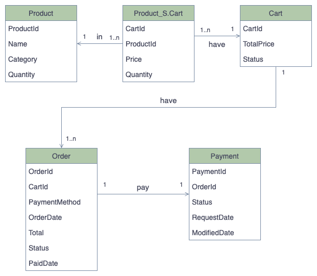

# Technical stack
- Framework: SpringBoot, SpringCloud 
- CI/CD: Kubernetes, Gitlab (GitLab Runner) and Ansible
- API Management: JavaDoc Or Swagger
- Server Framework: SpringBoot, JPA
- Security: JWT
- Databases: MySQL and Redis
- Message Broker: Kafka
- Log System: Elasticsearch (ELK), LogStash and Kibana
- Gradle to manage a master project and sub-projects

# Prerequisites 
- Java Development Kit LTS (>= 8) Or Kotlin 
- Gradle
- Docker

# Components
The entire system has 6 components, and each component has a different responsibility. My business feature in this design is **Shopping Cart and Order Management**

# High-Level Design
Based on C4Model concept, the view starts from Container Diagram to Component Diagram. Besides, the main flow also draws in sequence actions.

## Container Diagram

## Component Diagram

## Design Pattern
- Database Per Service
	+ Each service has its jobs and data, as single responsibility (SOLID), to avoid any conflict that leads to race-condition  
- Choreography-based SAGA
	+ Decentralize every single service, also means increasing scalability in this context 
- Event Sourcing
  	+ Focus on state changes, as a simple way to keep track 

# Database Design (ERD)

# Sequence Diagram of An Order

Other diagrams have not been mentioned, but utilize Event Messages to perform their jobs 
- SMS Notification 
- Email Notification

# Log Operation
As mentioned on Component Diagram, each service has its logs and syncs them by LogStash and Kafka
- Every order should have a unique request Id, similar to Correlation_Id. This Id goes through the entire services to fulfil their jobs.
- Service Logs can be queried on ELK and visualized on Kibana to estimate its performance

# Security
- AWS Route53
- JWT Token
- Internal API Gateway (nginx)
- External API Gateway (nginx) (whitelist: partner Ids)

# Scalablity 

# Concerns
The model is complex and what if there is an exception on the code base or even network interrupt, therefore the compensation is a must
## Compensation 

The sequence of state are stored in Event Store based on the Event Sourcing pattern, therefore there are 2 ways to compensate:
- Auto Revert
    + Every event state change is recorded, so an additional application is built up to perform reserve 
- Manual Revert
    + Consequence wrong info could stuck to the flows, so manually updating data is an option to keep the flow going 

## Wrong Auto Scale Out because of wrong information
- Messed-up CPU/RAM usage could be from an error/exception on the code base that could be misinformation to cause scaling out wrongly. Therefore, the metrics need to collect service logs to decide the threshold.
    + Metric-Server collects info from CAdvisor(kubelet)
    + Metric-Server also query to ELK on the pod that has problems with CPU/RAM high usage

# Pros and Cons
## Pros
1. Database Per Service, avoid conflict data because of cross accessing - loose coupling  
2. Kafka Message Broker, also a data streaming, meanings the programming is so natural and easy to understand the data flow
3. Ability to scale out/in  

## Cons
1. It is a complex model, so needs to involve many parts to build up, including programming and additional tools to fit in scalability
2. Compensation needs to consider serious
